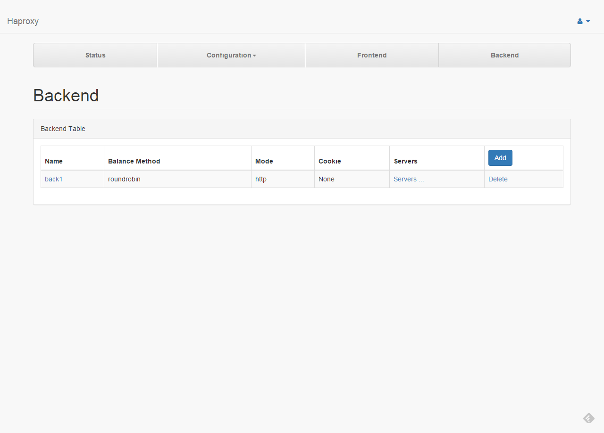
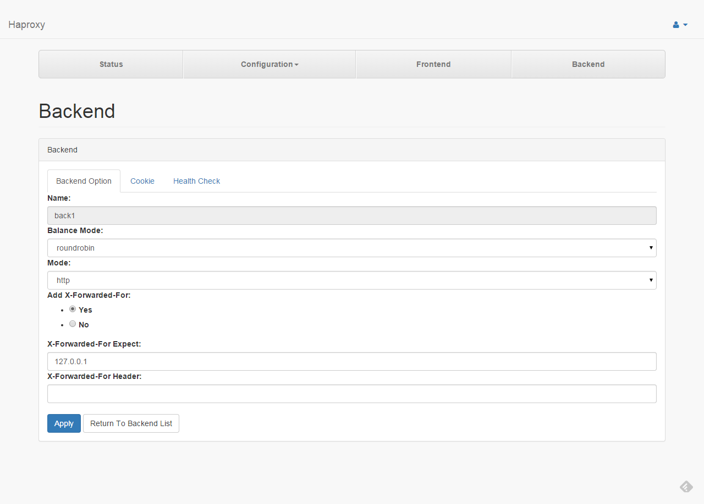
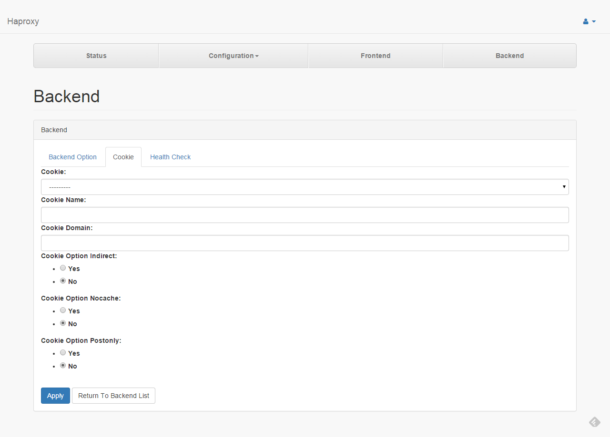
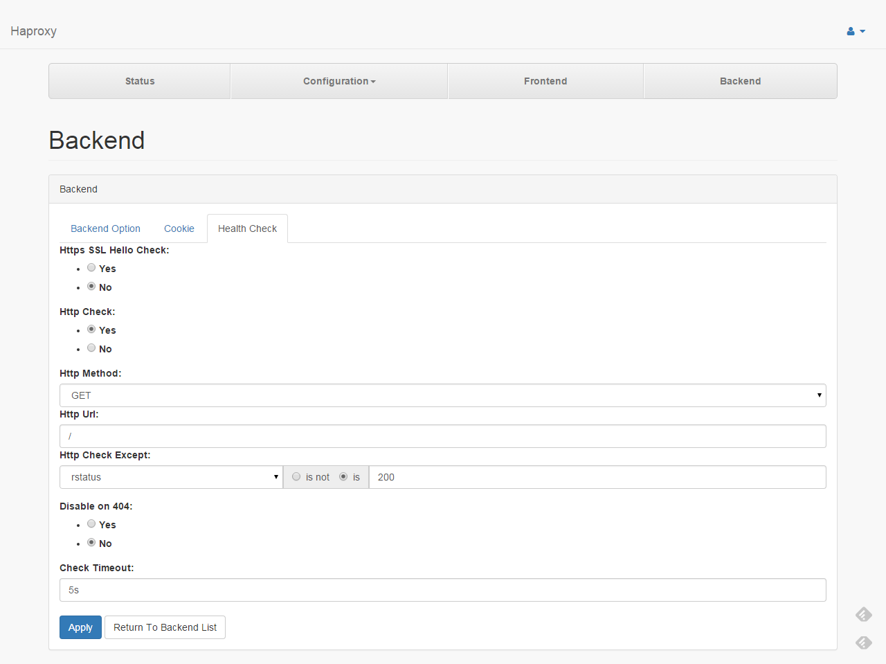

# Backend Config

####1.

This page list all backends.

---
####2.1

* **Name** : Backend Name
* **Balance Mode** : Define the load balancing algorithm to be used in a backend. "roundrobin" : Each server is used in turns, according to their weights. "leastconn" : The server with the lowest number of connections receives the connection. "source" : The source IP address is hashed and divided by the total weight of the running servers to designate which server will receive the request.
* **Mode** : Set the running mode or protocol of the instance.
* **Add X-Forward-For** : Enable insertion of the X-Forwarded-For header to requests sent to servers.
* **X-Forwarded-For Expect** : An optional argument used to disable this option for sources matching <network>.
* **X-Forwarded-For Header** : Used to supply a different header name to replace the default "X-Forwarded-For".

---
####2.2

* **Cookie** : Enable cookie-based persistence in a backend. "rewrite" : This keyword indicates that the cookie will be provided by the server and that haproxy will have to modify its value to set the server's identifier in it. "insert" : This keyword indicates that the persistence cookie will have to be inserted by haproxy in server responses if the client did not already have a cookie that would have permitted it to access this server. "prefix" : This keyword indicates that instead of relying on a dedicated cookie for the persistence, an existing one will be completed.
* **Cookie Name** : Cookie name.
* **Cookie Domain** : This option allows to specify the domain at which a cookie is inserted.
* **Cookie Option Indirect** : When this option is specified, no cookie will be emitted to a client which already has a valid one for the server which has processed the request.
* **Cookie Option Nocache** : This option is recommended in conjunction with the insert mode when there is a cache between the client and HAProxy, as it ensures that a cacheable response will be tagged non-cacheable if a cookie needs to be inserted.
* **Cookie Option Postonly** : This option ensures that cookie insertion will only be performed on responses to POST requests.

---
####2.3

* **Https SSL Hello Check** : Use SSLv3 client hello health checks for server testing.
* **Http Check** : Enable HTTP protocol to check on the servers health.
* **Http Method** : HTTP method used with the requests.
* **Http Url** : URI referenced in the HTTP requests.
* **Http Check Except** : Make HTTP health checks consider response contents or specific status codes. "status <string>" : test the exact string match for the HTTP status code. "rstatus <regex>" : test a regular expression for the HTTP status code. "string <string>" : test the exact string match in the HTTP response body. "rstring <regex>" : test a regular expression on the HTTP response body.
* **Disable on 404** : Enable a maintenance mode upon HTTP/404 response to health-checks.
* **Check Timeout** : Set additional check timeout, but only after a connection has been already established.

