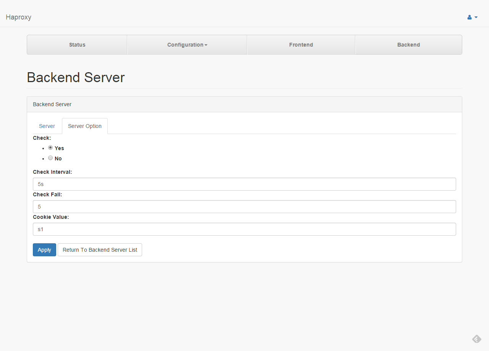

# Servers

####1
The page list all backend servers.

---
####2.1

* **Name** : Backend Server Name.
* **Address** : Backend Server Address.
* **Port** : Backend Server Port.
* **Weight** : Used to adjust the server's weight relative to
other servers.
* **Maximum Connections** : Fix the maximum number of concurrent connections.

---
####2.2

* **Check** : This option enables health checks on the server.
* **Check Interval** : Sets the interval between two consecutive health checks.
* **Check Fall** : States that a server will be considered as dead after
<count> consecutive unsuccessful health checks.
* **Cookie Value** : Sets the cookie value assigned to the server.
