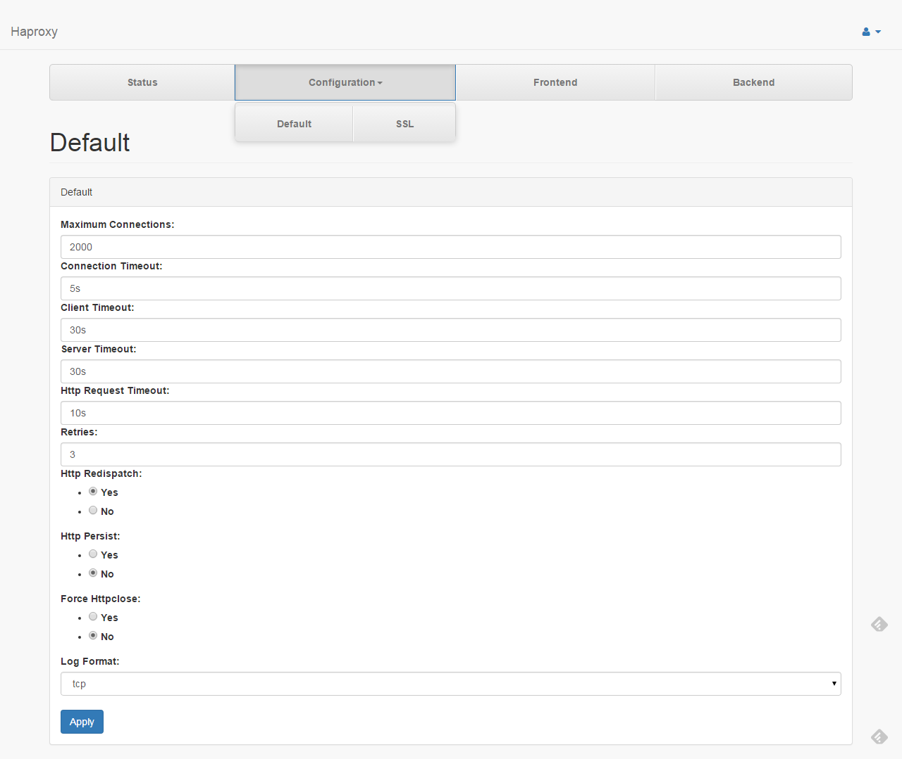

# Default

* **Maximum Connections** : Fix the maximum number of concurrent connections.
* **Connection Timeout** : Set the maximum time to wait for a connection attempt to a server to succeed.
* **Client Timeout** : Set the maximum inactivity time on the client side.
* **Server Timeout** : Set the maximum inactivity time on the server side.
* **Http Request Timeout** : Set the maximum allowed time to wait for a complete HTTP request
* **Retries** : Set the number of retries to perform on a server after a connection failure.
* **Http Redispatch** : Enable or disable session redistribution in case of connection failure.
* **Http Persist** : Enable or disable forced persistence on down servers. When an HTTP request reaches a backend with a cookie which references a dead server, by default it is redispatched to another server. It is possible to force the request to be sent to the dead server first using "option persist" if absolutely needed. A common use case is when servers are under extreme load and spend their time flapping. In this case, the users would still be directed to the server they opened the session on, in the hope they would be correctly served. It is recommended to use "option redispatch" in conjunction with this option so that in the event it would not be possible to connect to the server at all (server definitely dead), the client would finally be redirected to another valid server.
* **Force Httpclose** : Enable or disable passive HTTP connection closing
* **Log Format** : Enable advanced logging of HTTP or TCP connections with session state and timers.
