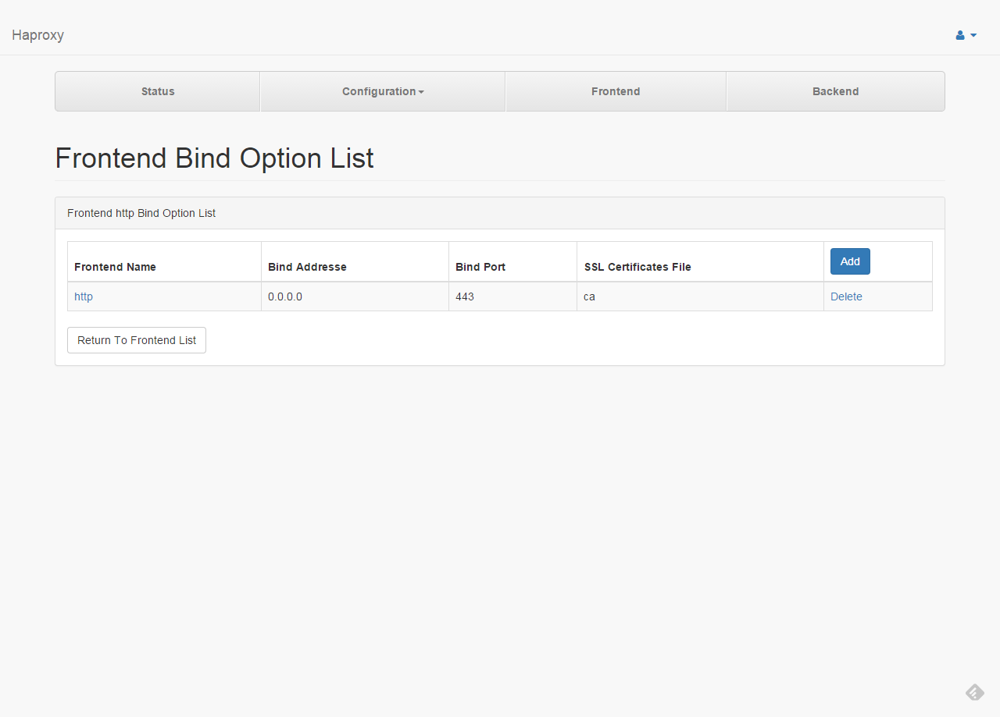
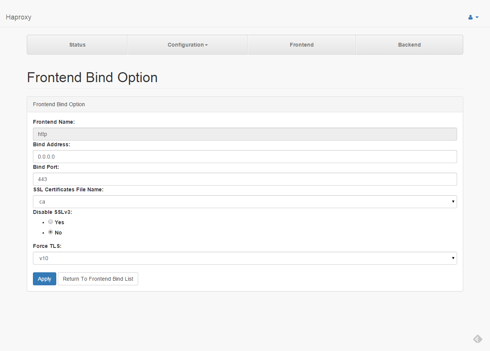

# Bind Options

####1

The page list all frontend bind addresse options.

---
####2

* **Name** : The name of frontend
* **Bind Address** : Define one listening addresse in a frontend.
* **Bind Port** : Define one listening port in a frontend.
* **SSL Certificate File Name** : Select a SSL certificate file for https.
* **Disable SSLv3** : It disables support for SSLv3 on any sockets instantiated from the listener when SSL is supported.
* **Force TLS** : This option enforces use of TLS only on SSL connections instantiated from this listener including v10,v11,v12.
