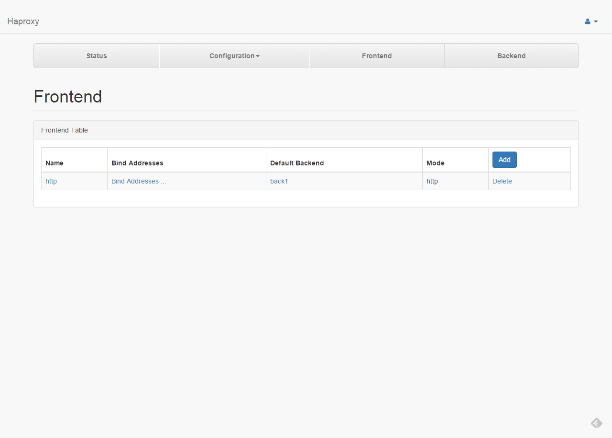
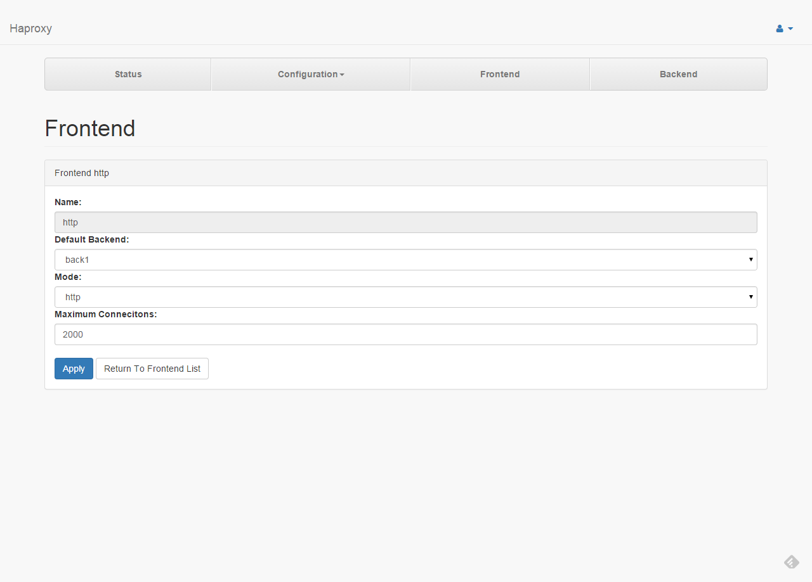

# Frontend Config

####1

This page list all frontends.

---
####2

* **Name** : Frontend name.
* **Default Backend** : Select a default backend.
* **Mode** : Set the running mode or protocol of the instance.
* **Maximum Connections** : Fix the maximum number of concurrent connections.

